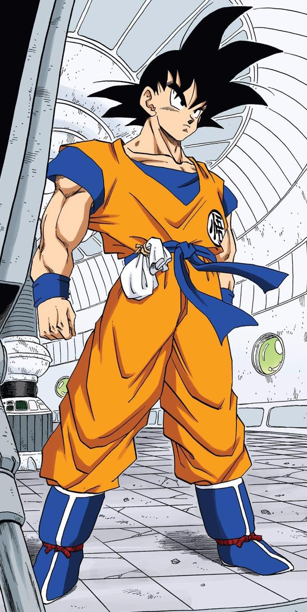
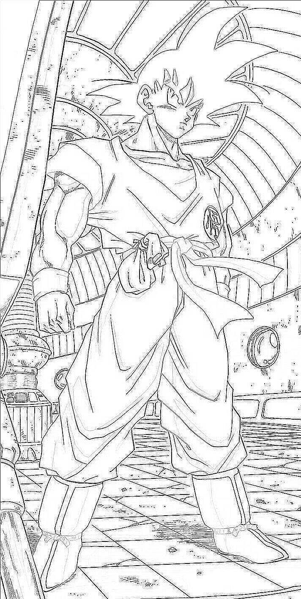

# Outline-Maker
Makes an outline to any image for drawing purposes using a laplacian filter. Libraries used are numpy and OpenCV.
Original image             |  Outline image
:-------------------------:|:-------------------------:
               | 
